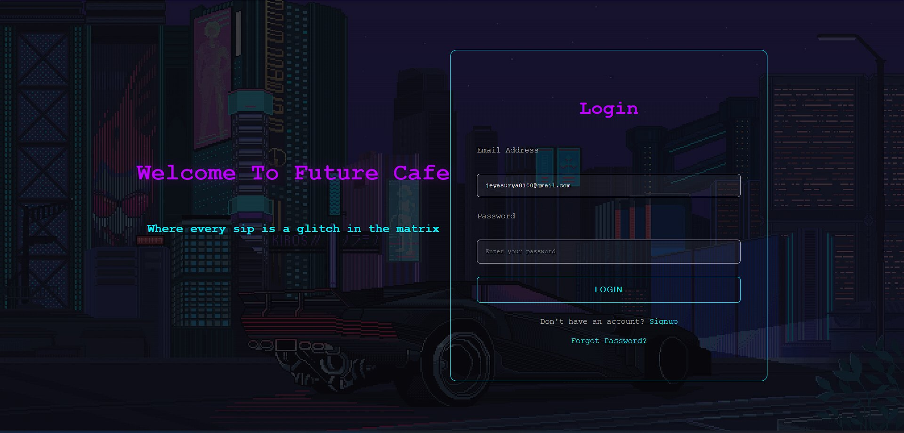
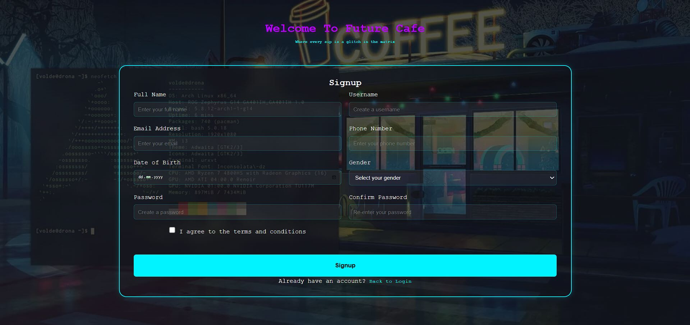
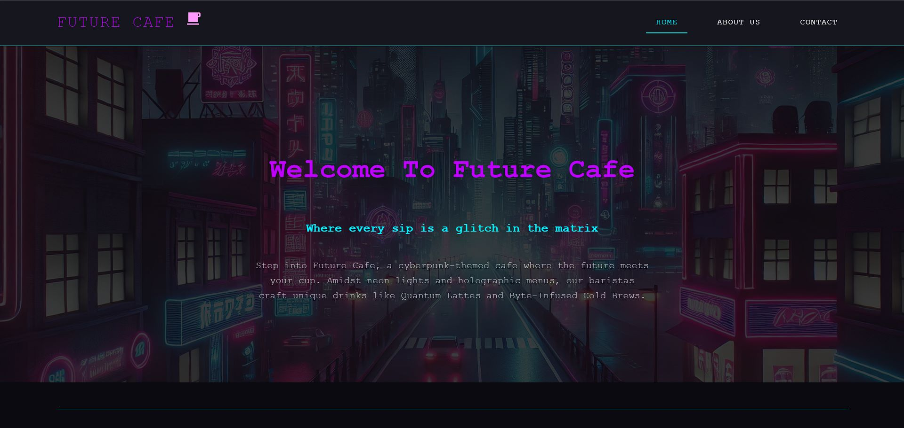

# ☕ Cafe Website

Welcome to the **Cafe Website** project! This website is a modern, responsive design for a cafe, built using HTML and CSS.

---
## Note:

This is a demo project. You can log in using any email ID and password. Just fill in the fields and click the Login button to proceed to the home page.

---

## 🌐 Live Demo
Access the website here: [Cafe Website](https://jeyasurya23.github.io/cafe-website/)

---

## 🎯 Key Features
- Sleek and modern neon-themed UI.
- Fully responsive design for all devices.
- Secure login and signup pages.
- Optimized performance and accessibility.

---

## 🖼️ Screenshots
### Login Page


### Signup Page


### Home Page


---

## 🛠️ Technologies Used
- **HTML5**: For the structure of the website.
- **CSS3**: For styling and layout design.

---

## 🚀 Quick Start
1. Clone the repository:
   ```bash
   git clone https://github.com/Jeyasurya23/cafe-website.git
   ```
2. Navigate to the project directory:
   ```bash
   cd cafe-website
   ```
3. Open `index.html` in your browser.

---

## 👨‍💻 About the Author
**Jeyasurya**  
A passionate Full Stack Developer creating engaging and responsive web applications.  
- GitHub: [@Jeyasurya23](https://github.com/Jeyasurya23)
- Portfolio: [Portfolio](https://jeyasurya23.github.io/portfolio/)
- LinkedIn: [LinkedIn](https://www.linkedin.com/in/jeyasurya-g/)

---

## 📄 License
This project is licensed under the MIT License.
